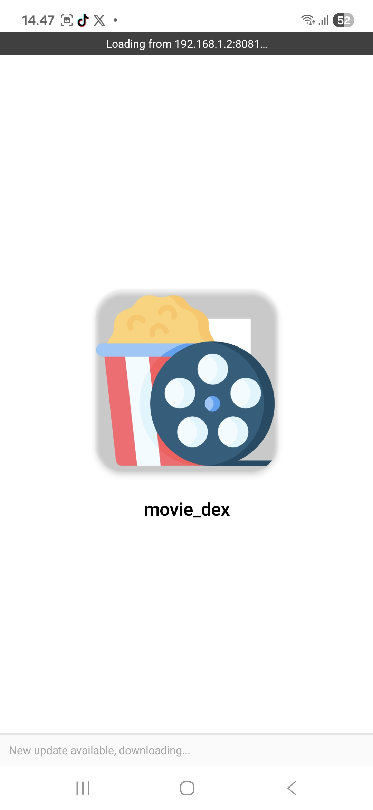
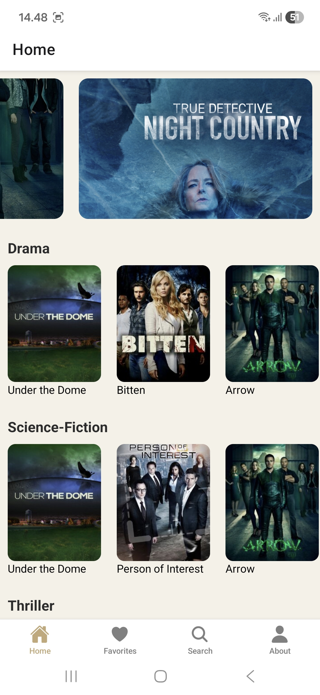
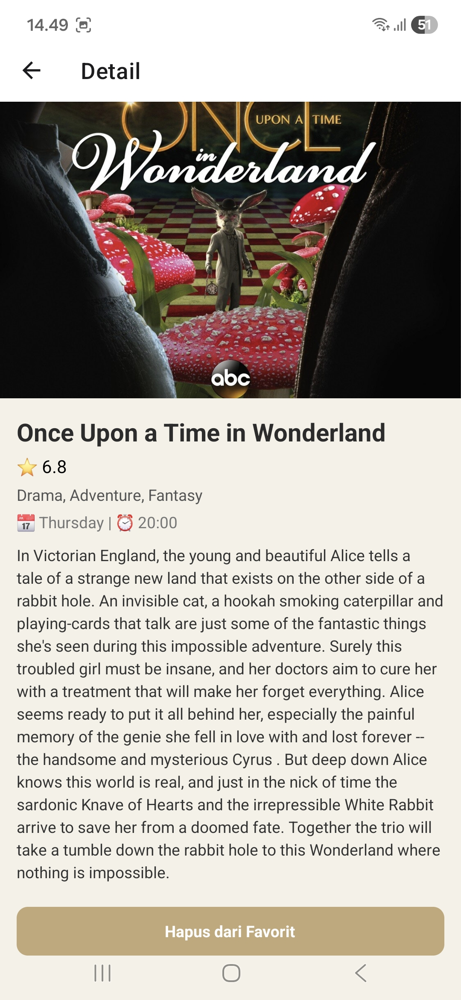
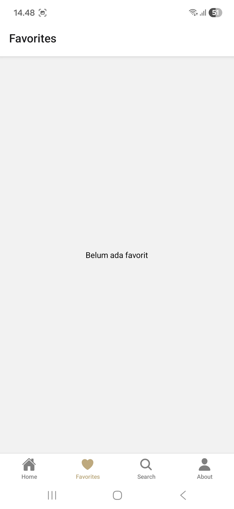
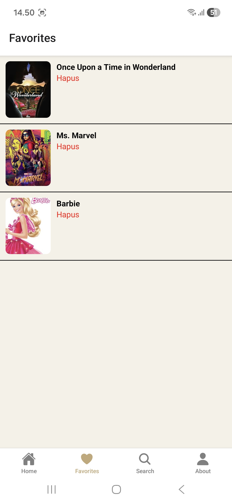
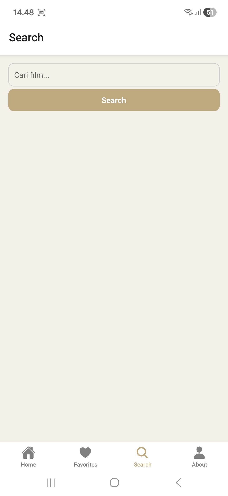
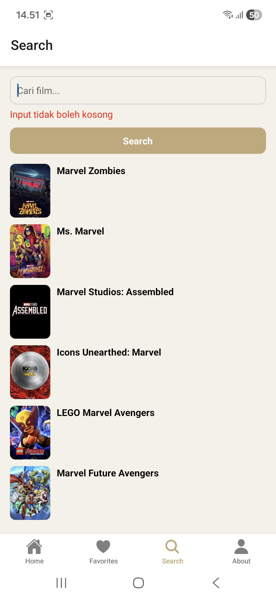
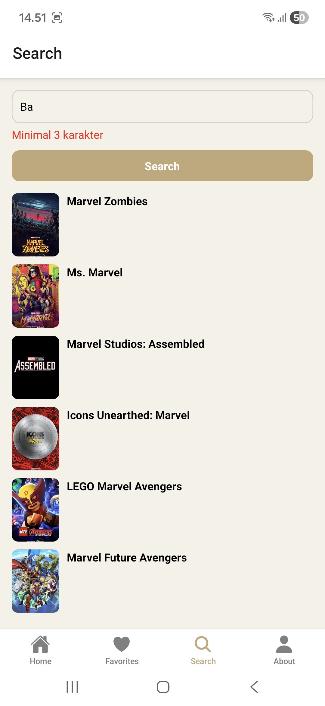
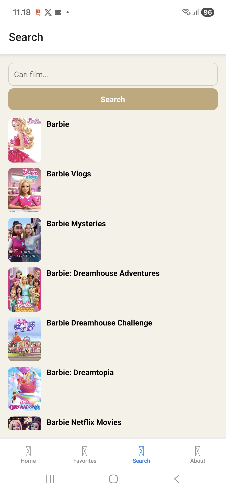
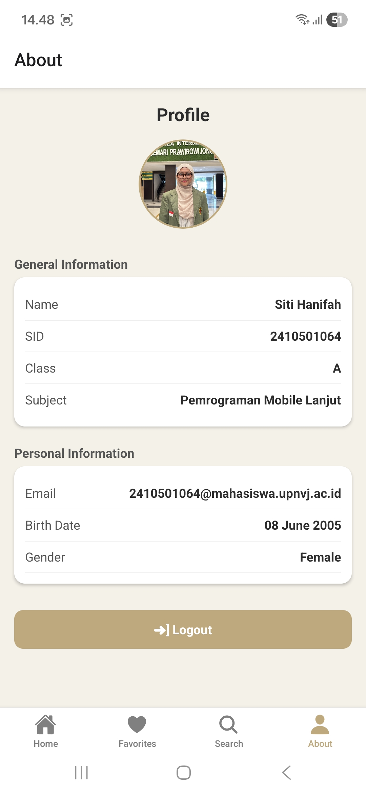

# MovieDex App
## Identitas:
- Nama  : Siti Hanifah
- NIM   : 2410501064
- Kelas : B

---

## Tema
- Tema yang dipilih: B - MovieDex (Katalog Film & Series)
- API              : https://api.tvmaze.com/

---

## Tech Stack
- React Native (0.81.5) >> Expo SDK ~54
- React (19.1.0)
- Expo (~54.0.33)
- JavaScript
- React Navigation
  - @react-navigation/native (^7.2.2)
  - @react-navigation/native-stack (^7.14.12)
  - @react-navigation/bottom-tabs (^7.15.11)
- React Vector Icons (^15.0.3)
- State Management: Context API + useReducer

---

## Cara Install & Menjalankan

1. Clone terlebih dahulu di terminal

   ```bash
   git clone https://github.com/Hanifahst/uts-mobile-lanjut-2410501064-SitiHanifah 
   ```

2. Masuk ke dalam folder

   ```bash
   cd movie_dex
   ```
3. npm Install

   ```bash
   npm install
   ```

4. Start expo

   ```bash
   npx expo start
   ```
5. Jalankan melalui Scan QR dengan Expo Go atau jalankan melalui emulator.

## Screenshot Screen
1. 
2. 
3. 
4. 
5. 
6. 
7. 
8. 
9. 
10. 

## Video Demo Aplikasi
Link Youtube >> https://youtu.be/4dhjLwuQrE8
Link Google Drive >> https://drive.google.com/drive/folders/1B-_RaYqq7Vxmhva0T2AIbqsjDURjy0p2?usp=sharing

## Penjelasan State Management + Justifikasi
Aplikasi ini menggunakan Context API dan UseReducer untuk mengelola global state, khususnya fitur Favorites. Alasan saya memilih kedua hal tersebut karena lebih sederhana penggunaannya dibandingkan Redux, cocok untuk membangun aplikasi berskala kecil-menengah, tidak memerlukan library tambahan karena sudah built-in dari React, serta mudah dipahami dan mudah diimplementasikan.

Contoh Implementasi:
- FavoritesContext.js sebagai global state.
- UseFavorites() untuk akses state dan dispatch.
- Action:
   - ADD_FAVORITE >> untuk menambahkan movie/series dari FavoritesSCreen.
   - REMOVE_FAVORITE >> untuk menghapus movie/series dari FavoritesScreen.

## Daftar Referensi
1. Tutorial Youtube : 
   - https://youtu.be/rWUhiK5DjQw?si=6nZO0nVtYImK-Pkc 
   - https://youtu.be/dWJgXqsVvzI?si=9NXEHonAm9qkORJ6
   - https://youtu.be/4G26TV1MLRM?si=CL-GE2SmmQ7Ex2qg
2. Dokumentasi : 
   - Dokumentasi React Native : https://reactnative.dev/
   - Dokumentasi Expo : https://docs.expo.dev/
   - Dokumentasi React Navigation : https://reactnavigation.org/
3. Stack Overflow : https://stackoverflow.com/
4. Ide Konsep UI : https://dribbble.com/

## Refleksi Pengerjaan
Selama pengerjaan aplikasi MovieDex ini, saya mengalami banyak kendala dan kesulitan. Pertama, saya sudah lumayan memahami pembuatan bagian setup awal project dan konfigurasi navigation, tetapi di perjalanan yang sudah 15% itu file saya hilang, dan saat dicari di recycle bin pun tidak ada. Hanya ada folder kosong (mungkin tidak sengaja terhapus saat saya ingin menghapus file yang tidak perlu di VS Code). Alhasil, saya harus membuat setup dari 0 lagi. Kedua, saya masih kebingungan dalam mengatasi konflik Expo Router dan React Navigation, yang menyebabkan aplikasi tidak berjalan dengan semestinya dan hanya menampilkan layar loading, tetapi sudah berhasil karena saya mencari referensi dari Youtube. Ketiga, saya masih suka kebingungan untuk masalah per-commit-an ke github sehingga butuh waktu untuk mempelajarinya ulang karena sempat ada merge conflict.

Melalui proses ini, saya belajar pentingnya memahami struktur project sejak awal serta memastikan penggunaan teknologi yang sesuai dengan requirement. Saya juga menjadi lebih paham cara kerja Git, terutama dalam menangani merge conflict sebelumnya, ternyata cukup simpel. Selain itu, saya belajar bagaimana cara mengatur navigation menggunakan Stack dan Bottom Tab Navigator, serta mengelola state dan cara kerja menggunakan Context API.

Secara Keseluruhan, pengerjaan proyek yang rumit ini memberikan pengalaman dan pencapaian yang sangat berharga dalam pengembangan aplikasi mobile menggunakan React Native navigation + Context API + UseReducer + Expo Go, serta dapat meningkatkan problem solving saya dalam menghadapi error dan bug.